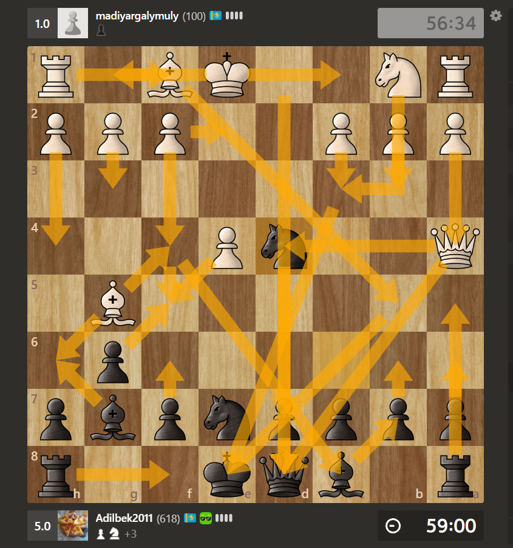
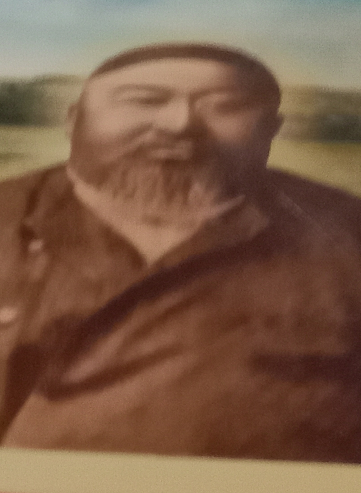
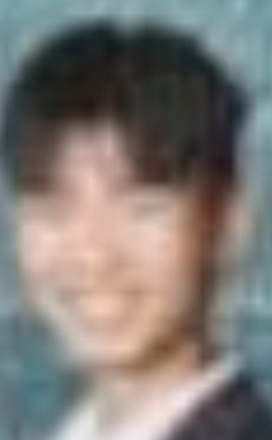

<html lang="en">
<head>
    <meta charset="UTF-8">
    <meta name="viewport" content="width=device-width, initial-scale=1.0">
    <title>The Site of the Memes</title>
</head>
<body bgcolor="#10000" text="#ffffff">
    Chill Guy
     
    

    <h2>Raiting top players be like:</h2>
     
    
     
    
    
     
    <b>МадиярПон</b>
    <h3><i>ИскоПон</i></h3>
    <h3><u>ДимашПон</u></h3>
</body>
</html>
